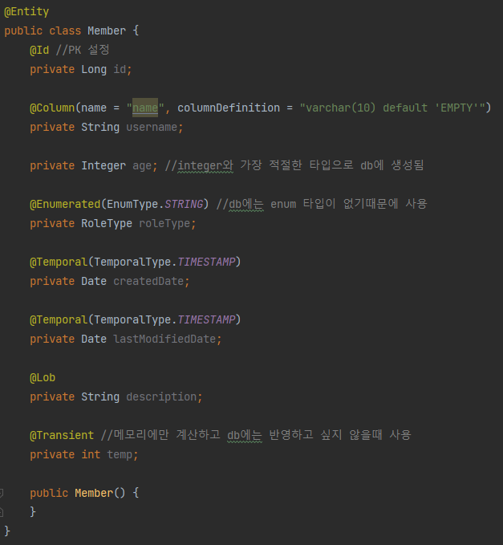
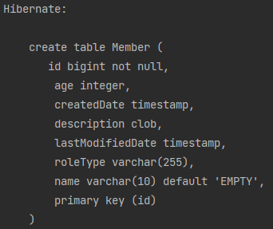

# 엔티티 매핑

## 객체와 테이블 매핑

- **객체와 테이블 매핑 @Entity , @Table**
    - jpa를 사용해서 객체를 테이블로 매핑
    - 기본 생성자 필수 (파라미터가 없는 생성자)
    - final 사용 X
    - Entity 속성
        - name - jpa에서 사용할 엔티티 이름 (하지만 보통 헷갈리기 때문에 기본값을 사용)
    - Table 속성
        - name - db에서 사용하는 테이블명을 지정할 수 있음
        - catalog
        - schema
        - uniqueConstraints
- **데이터베이스 스키마 자동 생성**
    - 테이블을 만들고 객체를 만드는것이 아닌 객체를 만들면 자동으로 DDL문을 생성하여 테이블을 만들어준다.
    - 데이터 베이스 방언을 활용해서 데이터베이스에 맞는 적절한 DDL문을 생성해준다.
    - 주의! 운영장비에는 절대 사용하면 안된다. 로컬에서 개발할때만 사용
    - `<property name="hibernate.hbm2ddl.auto" value="옵션 지정" />`
    
    
    
    *Member 객체*
    
    
    
    create문 자동생성
    
    - 옵션
        - create : 기존테이블 삭제 후 다시 생성 ( drop table → create table )
        - create-drop : create와 같으나 종료시점에 테이블 drop
        - update : 변경분만 반영 (alter table) 단, 컬럼을 없애는 변경은 안됨!
        - validate : 엔티티와 테이블이 정상 매핑되었는지만 확인 (ex 컬럼이 다름)
        - none : 사용하지 않음
- **생성 기능**
    - @Column
    - 속성
        - name = “username”
        - unique = true
        - length = 10
        - nullable = false
        

## 필드와 컬럼 매핑

- 매핑 어노테이션 종류
    - `@Column` : 컬럼 매핑
    - `@Temporal` : 날짜 타입 매핑
    - `@Enumerated` : enum타입
    - `@Lob` : BLOB, CLOB
    - `@Transient` : 특정 필드를 컬럼에 매핑하지 않고싶을 때 사용(db에 적용되지 않는 변수)

- `@Column` 속성
    - name : 필드와 매핑할 테이블의 컬럼이름
    - insertable, updatable : 등록하거나 변경할 때 제한할 수 있음 (기본값 true)
    - nullable : null값의 허용 여부를 설정 (false일 때 not null로 설정된다)
    - unique : 유니크 제약조건 (@Table의 속성인 uniqueConstraints와 같음)
    - columnDefinition : 데이터베이스 컬럼 정보를 직접 줌    
    - length : 문자 길이 제약조건 ( String타입에만 사용)
    - percision , scale(DDL)
        
        BigDecimal 타입에서 사용한다(BigInteger도 사용할 수 있다).
        precision은 소수점을 포함한 전체 자 릿수를, scale은 소수의 자릿수
        다. 참고로 double, float 타입에는 적용되지 않는다. 아주 큰 숫자나
        정 밀한 소수를 다루어야 할 때만 사용한다.
        
- `@Enum`
    
    *ORDINAL - USER : 0, ADMIN : 1*
    
    - EnumType.ORDINAL: enum 순서를 데이터베이스에 저장 (기본값)
        
        (사용X - enum에 항목추가시 숫자 순서가 바뀔 수 있기 때문)
        
    - EnumType.STRING: enum 이름을 데이터베이스에 저장
        
- `@Temporal`
    - TemporalType.DATE: 날짜, 데이터베이스 date 타입과 매핑 (예: 2013–10–11)
    - TemporalType.TIME: 시간, 데이터베이스 time 타입과 매핑 (예: 11:11:11)
    - TemporalType.TIMESTAMP: 날짜와 시간, 데이터베이스 timestamp 타입과 매핑(예: 2013–10–11 11:11:11)
    - 참고: LocalDate, LocalDateTime을 사용할 때는 생략 가능(최신 하이버네이트 지원)
- `@Lob`
    - @Lob에는 지정할 수 있는 속성이 없다.
    - 매핑하는 필드 타입이 문자면 CLOB 매핑, 나머지는 BLOB 매핑
    - CLOB: String, char[], java.sql.CLOB
    - BLOB: byte[], java.sql. BLOB
- `@Transient`
    - 필드 매핑X
    - 데이터베이스에 저장X, 조회X
    - 주로 메모리상에서만 임시로 어떤 값을 보관하고 싶을 때 사용
    

## 기본키 매핑

- 직접 할당 → `@Id` 사용
- 자동 생성 → `@GeneratedValue`
    - IDentity :데이터베이스에 위임, MYSQ
    - Sequence : 데이터베이스 시퀀스 오브젝트 사용, ORACLE (`@SequenceGenerator` 필요)
        - 최적화 : allocationSize = 50
    - Table : 키 생성용 테이블 사용, 모든 DB에서 사용 (`@TableGenerator` 필요)
    - Auto : 방언에 따라 자동 지정, 기본값

- 권장하는  식별자 전략
    - 기본 키 제약 조건: null 아님, 유일, 변하면 안된다.
    - 권장: Long형 + 대체키 + 키 생성전략 사용
