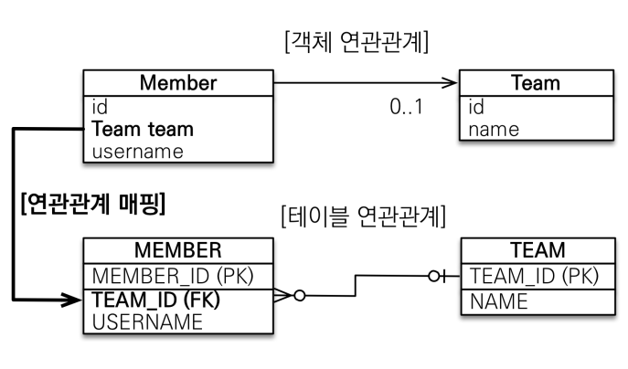

# 연관관계 매핑

### 잘 못된 경우

예제 - 회원 : 팀 = N : 1

잘못된 경우 : 객체 지향적 방법이 아님,

```java
@Id 
@GeneratedValue
@Column(name = "MEMBER_ID")
private Long id;

@Column(name = "USERNAME")
private String name;

@Column(name = "TEAM_ID")
private Long TeamId;
```

```java
//팀저장
Team team = new Team();
team.setName("TeamA")
em.persist(team);

//회원 저장
Member member = new Member();
member.setName("member1");
member.setTeam(team);
em.persist(member);

//member객체의 아이디로 찾음
Member findMember = em.find(Member.class, member.getId());
//찾은 회원의 소속 팀 아이디를 찾음
Long member_teamId = findMember.getTeamId();
//팀아이디로 팀 객체를 찾음
Team findTeam = em.find(Team.class, findTeamId);
```

## 단방향 연관관계



```java
@Id @GeneratedValue
@Column(name = "MEMBER_ID")
private Long id;

@Column(name = "USERNAME")
private String name;

@ManyToOne
@JoinColumn(name = "TEAM_ID")
private Team team;
```

- @ManytoOne - Many : Member, One : Team
- @JoinColumn(name = "TEAM_ID") - 조인하고 있는 컬럼의 db컬럼명

```java
//팀저장
Team team = new Team();
team.setName("TeamA")
em.persist(team);

//회원 저장
Member member = new Member();
member.setName("member1");
member.setTeam(team);
em.persist(member);

//member객체의 아이디로 찾음
Member findMember = em.find(Member.class, member.getId());
//바로 Team객체를 불러와 Team객체에 저장된 팅의 이름을 찾음
System.out.println("findMember Team : " + findMember.getTeam().getName());
```

```java
//팀 아이디가 100번인 팀이 있다고 가정
Team newTeam = em.find(Team.class, 100L);
//merber 객체의 팀을 새로운 팀으로 변경
findMember.setTeam(newTeam);
```

## 양방향 연관관계와 연관관계의 주인

```java
Team team = new Team();
team.setName("TeamA");
em.persist(team);

Member member1 = new Member();
member1.setName("member1");
member1.setTeam(team);
em.persist(member1);

Member member2 = new Member();
member2.setName("member2");
member2.setTeam(team);
em.persist(member2);

**em.flush(); // 영속성 컨텍스트에 있는 쿼리를 db로 날림
em.clear(); // 영속성 컨텍스트를 비움**

Member findMember = em.find(Member.class, member1.getId()); // db에서 값을 가져온다.
System.out.println("Team = " + findMember.getTeam().getName());

List<Member> members = findMember.getTeam().getMembers(); //양방향 연관관계

for (Member m : members) {
    System.out.println("m = : " + m.getName());
}
```

em.fluch(); 로 영속성 컨텍스트에 있는 쿼리를 db로 날린 후 em.clear(); 하여 영속성 컨텍스트를 비우면 em.find()로 조회했을 때 1차캐시가 아닌 db에서 값을 찾아오기 때문에 findMember에 해당하는 팀의 회원리스트를 받아 올 수 있다.

만약하지 않으면 1차캐시에서 값을 받아오기 때문에 

- OnetoMany
    - 1 : N의 관계이기 때문에Collection으로만 받을 수 있다
    

### 객체와 테이블이 연관관계를 맺는 차이

- 테이블 : 외래키 하나로 양방향 연관관계를 가진다
- 객체 : 양방향을 참조하기 위해서 단방향관계 2개로 양뱡향 연관관계를 가진다.

### 연관관계의 주인

- 객체의 두관계중 하나를 연관관계의 주인으로 지정한다.
- 연관관계의 주인만이 외래키를 변경할 수 있다.
- 주인이 아닌쪽은 읽기만 가능하다.
- **주인이 아닐 경우 mappedBy 속성으로 주인을 지정한다.**
- jpa가 db에 값을 넣을 때는 주인의 값만 참조하여 db에 저장한다.

### 누구를 주인으로? → 외래키가 있는곳이 주인

외래키가 있는곳이 N, 없는곳은 1 (많은 쪽이 주인이된다.)

```java
Team team = new Team();
team.setName("TeamA");
em.persist(team);

Member member = new Member();
member.setName("member1");
em.persist(member);

//jpa에서 참조하진 않지만 순수한 객체 관계를 고려하면 항상 양쪽다 값을 입력해야한다.
team.getMembers().add(member); 

//연관관계의 주인에 값 설정
member.setTeam(team); //jpa 참조

```

- 편의 메소드를 이용가능
    
    주의! 한군데서만 해야한다.
    

📍**양방향 연관관계 주의 - 실습**

- 순수 객체 상태를 고려해서 항상 양쪽에 값을 설정하자
- 연관관계 편의 메소드를 생성하자
- 양방향 매핑시에 무한 루프를 조심하자
    
    예: toString(), lombok, JSON 생성 라이브러리
    

결론 - 단방향을 권장하지만 JPQL사용으로 인해 양방향 연관관계를 만들 수 있다.
