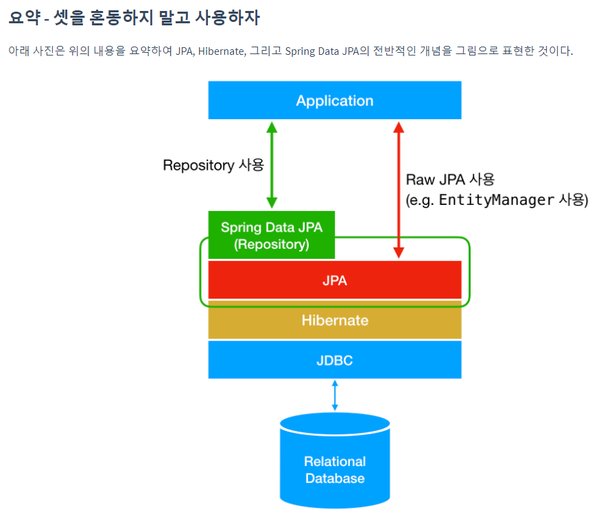

# JPA 개요 및 시작하기

- java 가 jpa를 통해서 jdbcAPI를 사용해서 db와 연동
- 패러다임의 불일치를 해결해준다.
- 쿼리를 손대지 않아도 됨 → 유지보수 용이성

### ORM

- Object-relational mapping(객체 관계 매핑)
- 객체는 객체대로 설계
- 관계형 데이터베이스는 관계형 데이터베이스대로 설계
- ORM 프레임워크가 중간에서 매핑
- 대중적인 언어에는 대부분 ORM 기술이 존재


저장 : jpa.persist

조회 : Member member = jpa.find(”memberId”)

수정 : Member.setName();

수정 : jpa.remove();

### JPA의 성능향상

1. 1차 캐시와 동일성(identity) 보장
2. 트랜잭션을 지원하는 쓰기 지연(transactional write-behind)
3. 지연 로딩(Lazy Loading)과 즉시로딩 → 옵션으로 관리 할 수 있다!

### JPA 하이버네이트

쓰는 이유

JPA는 말 그대로 **인터페이스**라는 점이다. JPA는 특정 기능을 하는 **라이브러리가 아니다**.

JPA 역시 자바 어플리케이션에서 관계형 데이터베이스를 어떻게 사용해야 하는지를 정의하는 한 방법일 뿐이다.

**Hibernate는 JPA의 구현체이다.**

Hibernate는 **JPA라는 명세의 구현체**이다. 즉, 위에서 언급한 `javax.persistence.EntityManager`와 같은 인터페이스를 직접 구현한 라이브러리이다. **JPA와 Hibernate는 마치 자바의 interface와 해당 interface를 구현한 class와 같은 관계**이다.

### Spring Data JPA

Spring Data JPA는 JPA를 쓰기 편하게 만들어놓은 모듈이다

Spring Data JPA는 Spring에서 제공하는 모듈 중 하나로, 개발자가 JPA를 더 쉽고 편하게 사용할 수 있도록 도와준다. 이는 **JPA를 한 단계 추상화시킨 `Repository`라는 인터페이스를 제공함으로써 이루어진다**. 사용자가 `Repository` 인터페이스에 정해진 규칙대로 메소드를 입력하면, Spring이 알아서 해당 메소드 이름에 적합한 쿼리를 날리는 구현체를 만들어서 Bean으로 등록해준다.




### JPA 설정하기 - persistence.xml

```xml
<!-- 필수 속성 -->
<property name="javax.persistence.jdbc.driver" value="org.h2.Driver"/>
<property name="javax.persistence.jdbc.user" value="sa"/>
<property name="javax.persistence.jdbc.password" value=""/>
<property name="javax.persistence.jdbc.url" value="jdbc:h2:tcp://localhost/~/test"/>
<property name="hibernate.dialect" value="org.hibernate.dialect.H2Dialect"/>
```

- 어떤 db를 사용하는가
- db이름
- db 비밀번호
- db 위치
- jpa는 특정 데이터 베이스에 종속되지 않게 되어있다.
    
    db 마다 표준적이지 않는 특정 데이터 베이스만의 고유한 기능(방언) 을 번역해서 써주기 위해서 Dialect를 사용한다
    

### JPQL

JPA는 SQL을 추상화한 JPQL이라는 객체 지향 쿼리 언어 제공
• SQL과 문법 유사, SELECT, FROM, WHERE, GROUP BY,HAVING, JOIN 지원
• JPQL은 엔티티 객체를 대상으로 쿼리
• SQL은 데이터베이스 테이블을 대상으로 쿼리


## 문법

```java
import javax.persistence.Column;
import javax.persistence.Entity;
import javax.persistence.Id;
import javax.persistence.Table;

@Entity //jpa를 사용하겠다고 선언해주는 의미?
//@Table(name = "USER") : USER라는 테이블 사용
public class Member {

    @Id //primary key
    private Long id;

    //@Column(name = "username") : 컬럼명 지정
    private String name;

    public Long getId() {
        return id;
    }

    public void setId(Long id) {
        this.id = id;
    }

    public String getName() {
        return name;
    }

    public void setName(String name) {
        this.name = name;
    }
}
```


```java
public class JpaMain {
    public static void main(String[] args) {
        EntityManagerFactory emf = Persistence.createEntityManagerFactory("hello");
        EntityManager em = emf.createEntityManager();

        //트랜잭션 처리
        EntityTransaction tx = em.getTransaction();
        tx.begin();

        //code
        try{ //원래는 스프링이 처리함
            Member member = new Member();
            member.setId(1L);
            member.setName("HelloA");
            em.persist(member); //저장

            Member findMember = em.find(Member.class, 1L); //조회
            System.out.println("findMember.id : " + findMember.getId());
            System.out.println("findMember.Name : " + findMember.getName());

            findMember.setName("HelloJpa"); //수정
            System.out.println("findMember.id : " + findMember.getId());
            System.out.println("findMember.Name : " + findMember.getName());

            //JPQL
            //테이블을 대상이 아닌 객체를 대상으로 쿼리를 작성한다.
            List<Member> result = em.createQuery("select m from Member as m",Member.class)
                    .setFirstResult(1) //pagenation : 1번부터 5번까지 가져옴
                    .setMaxResults(5)
                    .getResultList();

            tx.commit();
        }catch (Exception e){
            tx.rollback();
        }finally {
            em.close();
        }

        emf.close();
    }
}
```

### 📍중요!! 주의!!

엔티티 매니저 팩토리는 웹서버가 실행되는 시점에 하나만 실행이 되는것 db당 하나

엔티티 메니저는 고객의 요청이 올때마다 썼다가 버렸다가 동작한다. (쓰레드간 공유 X, 마치 DB Connection을 쓰고 닫는거랑 똑같음)

jpa에서는 트랜잭션 단위가 중용 모든작업 에서 해줘야한다.
